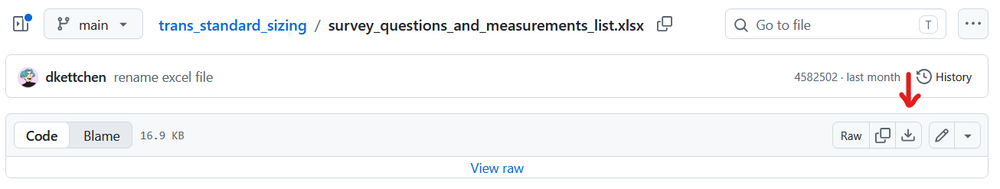
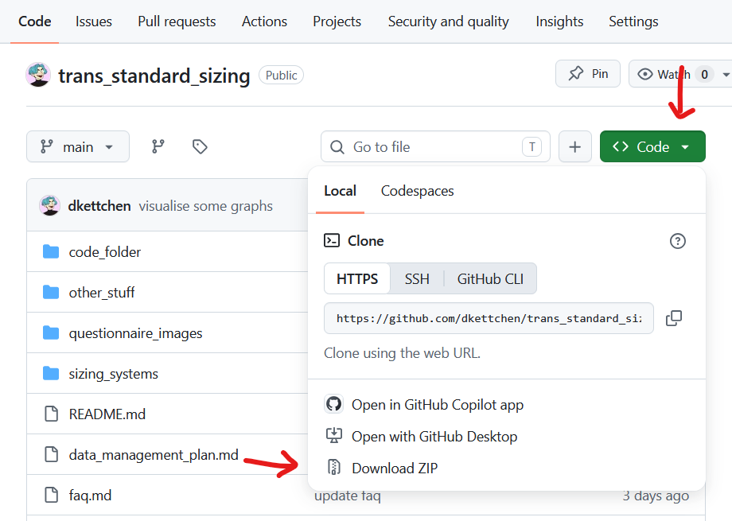

# The Trans Standard Sizing Project
## Useful links, site map, and how to download files from github

### Follow the project
You can follow my own socials (@dkettchen) for now, but I am also working on making accounts (on tumblr and insta) for my fashion projects (coven), including this project:
- Tumblr 
    - [coven](https://renzoller-coven.tumblr.com/)
    - [dkettchen](https://dkettchen.tumblr.com/) 
- Instagram 
    - coven [coming soon]
    - [dkettchen](https://www.instagram.com/dkettchen/)
- [Bsky](https://bsky.app/profile/dkettchen.bsky.social)
- [Youtube](https://www.youtube.com/@DKettchen)

### Trans body measurements survey
- For trans people who have been 3+ years on HRT (see participation info for more details)
- Runs until end of 2026
- Link to the survey: https://www.tinyurl.com/trans-standard-sizing
- [Copy of the participation info](survey_participation_information_sheet.md)
- [Copy of the questionnaire](survey_questionnaire.md)
- [Excel file with measurements list](survey_questions_and_measurements_list.xlsx) - there is a download button on github you can click in the top-right of the file page (see [below](README.md#downloading-files) for a screenshot)

We'll also be tabling at various pride events this summer, where you can get measured in person
- [List of pride events 2026](pride_events_2026.md)

Our minimum goal is 50 responses per direction, we are currently at: (last updated 5 Aug 2026)
- Transmascs &emsp; IIIII IIIII IIIII IIIII IIIII IIIII IIIII IIIII IIIII IIIII | IIIII IIIII II (62) - (38 until stretch goal of 100) |
- Transfemmes &nbsp; IIIII IIIII IIIII IIIII IIIII IIIII IIIII &emsp;&emsp; &emsp; &emsp; | &emsp;&emsp;&emsp;&emsp;(35) - (16 until minimum goal of 50)

### Site map
- [FAQ](faq.md)
- [Methodology doc](methodology.md)
- [Flyer](trans_standard_sizing_pride_sign%20without%20bleed.png)
- [Licensing info](license.md) (This project's data and results are published for free for anyone to use (with credit))
- [AI use info](machine_learning_policy.md) (This project uses no AI. If you want to use this data with or for any AI, read this first, as we have rules.)

### Results [WIP]
I have started processing the body measurement data. This is where you can find the resulting data files and diagrams. These files will be updated as more responses come in and I rerun the code.
- [Charts](code_folder/files/charts/)
- [Raw response data file (not cleaned or formatted yet)](code_folder/files/responses_20_july_2026.csv) [not live, just whatever the latest file was when I last downloaded it, eventually it'll be the full dataset when it's done!]
- [Cleaned responses in cm](code_folder/files/full_clean_response_data/cleaned_full_responses_in_cm.csv)
- [Cleaned responses in inch](code_folder/files/full_clean_response_data/cleaned_full_responses_in_inch.csv)
- We also have the same data separated by transition direction and certain sets of the questions in the [separated_data folder](code_folder/files/separated_data/)
- The processed data used for the diagrams can be found in the [processed_data folder](code_folder/files/processed_data/)
- The actual code can be found in the [code_folder](code_folder)

### Downloading files
You can download any file from github by clicking the download button in the top-right of the file page:

If you want to download the whole project folder, you can get a zip file of it here:

# Project Info
## The Trans Standard Sizing Project
<!-- project description -->

Fashion industry uses a set of standard measurements to draft and "grade" their sewing patterns for different sizes. This way most people are able to go to a store and find clothes that roughly fit them. These measurements were made based on prior anthropometry studies collecting the general population's body measurements, which means they are made with cis people's proportions in mind.

A lot of trans people struggle to find clothes that fit them off-the-rack, as medical transition has its limitations and trans proportions differ from those of cis people of the opposite birth sex. 

> Ex. Bones seal off after one's initial puberty, meaning even if you get HRT after that, things like your height or hip and shoulder width won't change anymore.

Existing sewing resources also heavily rely on these cis standard measurements, meaning even custom making clothes for trans people requires extensive fitting and pattern manipulation beyond most hobbyists' abilities.

However, most trans people did fit into their birth sex's sizes pre-transition, so trans proportions are no more inconsistent than cis ones. Current sewing resources and commercial sizing just weren't made for them!

If there were standard measurements and drafting methods that work for trans proportions, one could make sewing patterns (custom or ready-made) and create clothes that fit trans people as well as what cis people can expect from store-bought clothes.

> Ex. Getting a suit made-to-measure by a professional tailor is incredibly expensive, but if we had a drafting method and/or ready-made pattern for a transmasc suit, any transmasc with sewing skills (or access to someone else's sewing skills) could make a suit that fits them as well as what cis men can buy at the store for essentially just material costs.

This will not only be useful to trans people and their loved ones making them clothes at home, but also to anyone in fashion industry/clothing manufacturing who has trans clients.

> Ex. I need high-vis at work, but don't fit standard issue. Ill-fitting PPE is not regulation, so we need to get it custom made for me. Our supplier has meanwhile *LITERALLY GIVEN UP* as they can't provide the level of custom drafting/in person fitting required, so we will need to use a professional tailor instead.
If there was guidance for how to source custom PPE based on our precedent, other companies would have an easier time with it in future.
And if one could draft ready-made patterns for trans people, suppliers could even just have trans "standard issue" patterns on file for cases like this.

### Goal of the project

The goal of this project is to make it easier to size clothing for trans people who struggle to find gender-appropriate clothes off-the-rack.

It will primarily involve:
- creating amateur-friendly, measurement-based pattern drafting methods that work for any proportions and require minimal pattern adjustment after drafting to fit as well as what other people can expect from store-bought clothes
- providing an evidence base of post-transitional trans adults' body measurements, and data-informed trans standard measurements to use for pattern drafting ready-made trans sizing
- guidance on making, adjusting, and otherwise navigating clothes for trans people, notably in a work wear setting (ex. uniforms, business wear, PPE), and on adjusting the fit of high-vis while remaining compliant with UK regulations

Ideally the results of this project will also be useful to:
- create trans sized garments in textile crafts other than sewing/tailoring (f.e. knit wear)
- other fields where body measurements make a difference and trans people's measurements are currently not accounted for (f.e. calculating chest volume in cardiovascular science)
- cis people with custom fit needs (f.e. anyone of unusual height, plus sized, and/or with certain disabilities)

### Additional information

The scope of the project and its various parts is laid out in more detail in our [methodology document](methodology.md).

This project is **trans-led** and done with the express goal of improving trans people's quality of life.
All its **results** will be open access **published for free** for anyone to use. More information can be found in our [licensing document](license.md).

For any other questions, please check our [FAQ](faq.md).

## Who is running this project?
<!-- about me -->

Hi! My name is Ren Zoller (@dkettchen). I'm a gender non-conforming trans man in my late 20s based in Manchester, UK. 

I was a femme-presenting nonbinary for about a decade and only started successfully being able to pass as male as recently as 2024 (5+ years into medical transition). 
With misgendering suddenly no longer being unavoidable, I had to actually seriously engage with men's fashion for the first time in my life.

As someone who has been obsessed with fashion and had no problem buying clothes I wanted off-the-rack most of my life, switching to men's fashion exclusively has been a very frustrating process (albeit worthwhile due to the no more misgendering).

- Men's fashion follows different rules and shape language than women's (ex. men's pant waist is in a fully different spot than women's), so most of my previous garments are useless to it.

- I don't fit standard men's sizes, so I can't just go to the store and buy new items that fit me, even from the limited selection available there.

- And even as a self-taught seamster making my own clothes, most sewing resources only cover women's fashion. 
Men's specific resources are highly limited (men only wear business pants and suit jackets, right??) and their methods often aren't very robust outside of using cis standard measurements (my measurements will literally break their dang clown math whenever I try to follow supposedly "bespoke" drafting methods).

I know I'm by far not the only trans person with this problem. So many of us (transmasc or transfemme) struggle to find clothing in the right size and shape, and I know notably a lot of transmascs are put off by the perceived lack of options among men's fashion.

I want to make fashion more accessible and fun for us again (*without* every last one of us having to essentially become a fully-qualified tailor about it).
This research project will form the foundation for that.

In my day job I work as a data engineer at Metrolink, and am a degree apprentice in data analysis at Manchester Metropolitan University. I also have a background in art/visual storytelling and trans community work/LGBT+ awareness training.

## What will the project entail?

### Trans pattern drafting

This aspect of the project intends to:

1) Demonstrate that existing pattern drafting methods are inadequate for trans measurements.

2) Develop measurement-based pattern drafting methods that will require minimal fitting and pattern manipulation for cis as well as trans proportions.
    - A method to draft a transmasc suit (pants and a jacket), as appropriate suitwear is a core style of menswear and currently inaccessible to most transmascs.
    - A method to draft a bodice and pant block pattern for transmascs and transfemmes, as these will enable drafting any other styles from there.

3) Produce sample garments using these drafting methods.
    - To present the project at relevant events.
    - Pictures of final garments, modelled on a fit model or trans-sized mannequin/dress form, will be included in the project data where possible.

While we lack trans standard measurements, we will be using our fit models' measurements for drafting. For transmasc "regular" sizing, I will be our main fit model, as I am of average afab height and fit well into women's standard sizing pre-transition. For other transmasc categories and transfemme sizing, I will ask relevant friends and acquaintances to provide measurements and allow me to fit on them.

These drafting methods will be published for anyone to use.

### Trans body measurements

A survey to gather post-transitional trans people's body measurements, as well as context data.
- The survey is currently live at this link: https://tinyurl.com/Trans-Standard-Sizing - Any sharing is appreciated.
- A copy of the participation information can be found [here](survey_participation_information_sheet.md).
- The survey at minimum collects [14 required measurements](questionnaire_images/required%20measurements%20-%20the%20bare%20minimum.png) and data about the respondents' bodies and relationship to standard sizing. There are also a number of optional measurements. A copy of the full survey questionnaire can be found [here](survey_questionnaire.md).
- For now the survey will be live until the end of 2026, but it will run for as long as needed to get at least 50 responses for each direction.
- In summer 2026 I plan to attend pride events across the UK to measure people in person and/or spread the word to get more respondents. A list of the events can be found [here](pride_events_2026.md).

The resulting fully anonymous anthropometry data set will be open access published in relevant academic outlets/repositories to make it available to other researchers in fashion and any other fields it may be useful to.

### Trans standard measurements

1) Survey data will be processed, analysed and compared to existing anthropometry data sets to gain insights and determine trans standard measurements using custom code that will be created for this purpose.

2) The resulting standard measurements will be tested using our drafting methods and fit models to assure they fit as well as cis standard measurements do for cis people.

3) The resulting insights will be written up in an appropriate format to be published as an article/paper on the subject. 

4) The standard measurements will be published for anyone to use.

### Trans and gender diverse PPE and work wear guidance

This part of the project intends to:

1) Develop a recommended process for sourcing trans-sized PPE/work wear/uniform garments for relevant trans workers.

2) Develop recommendations on navigating trans and gender diverse workers' needs, circumstances, and timelines when it comes to gendered fashion at work.

3) Provide information for making trans-sized garments to pass along to a tailor or manufacturer. This should include regulatory information, trans-inclusive drafting methods, etc.
    - While the guidance will largely focus on PPE/trade work wear, it should also include advice on formal wear as business casual is required for a lot of office jobs.
    - The guidance on how to navigate customisation while adhering to PPE regulations should also be applicable to non-trans workers in need of a custom fit for their PPE, as this is not a problem exclusive to trans workers, and everyone deserves (and is required by the regulations to have) well-fitting work wear.

4) Establish an evidence base to strengthen the business case for companies to use this guidance.

5) Publish the resulting guidance in industry outlets and present it at industry events.

6) Ask lgbt+ organisations to include this guidance on their resource lists, so that employers and trans workers can easily find it.

This part of the project will require the collaboration of relevant stakeholders in the UK transport sector.

## Acknowledgements

Special thanks to ~ for ~ :
- MMU's Rise "Making Great Community" Incubator 2026 - awarding this project seed funding and mentoring
- The MMU Library's Open Access Research Team - providing resources and workshops on research data management and Open Access research publishing that all students can access
- TransMasculine Advice & Support (TMSA) UK's private facebook groups and anyone who contributes to their top surgery albums - providing a good overview of the different scar shapes people get from double incision and insight into what keyhole/perioareolar results look like -> informing my illustrations and requested scar measurements in the survey
- Grid - measurement survey proof-reading and explaining peer review to me
- Laura - additional measurement survey proof-reading
- My lovely friends Sophie, Grid, Kaily, Cris, Laura and Leah - helping out with stalls and flyering at events! 
