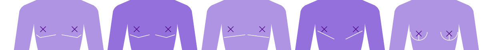

# Table of Contents
- [Vocab](#vocab)
- [Guiding principles](#guiding-principles)
    - [Gender theory this project prescribes to](#gender-theory-this-project-subscribes-to)
    - [General principles](#general-principles)
    - [Anthropometry study / standard siing / ready-made](#anthropometry-study--standard-sizing--ready-made)
        - [Priorities](#priorities)
    - [Sewing resources](#sewing-resources)
    - [PPE guidance](#ppe-guidance)
- [Scope](#scope)
    - [Of clothing items we want to be able to make](#of-clothing-items-we-want-to-be-able-to-make)
    - [Of demographic representation in our anthropometry data set](#of-demographic-representation-in-our-anthropometry-data-set)
    - [Of physical body types we record in our anthropometry data set](#of-physical-body-types-we-record-in-our-anthropometry-data-set)
- [Sources](#sources)
    - [Determining measurements to collect](#determining-measurements-to-collect)
    - [Other bibliography](#other-bibliography)

# Vocab
**PPE** = Personal Protective Equipment, f.e. high vis, steel toed boots, gloves, eye protection, helmets, masks, etc

**ANTHROPOMETRY** = "[The] study of human body measurements especially on a comparative basis" (Merriam-Webster Dictionary)

**TRANS** = prefix that means "on opposite sides". People whose "true" gender does not align with their birth sex. For the purpose of this project: People who do not want to pass as their birth sex and, if able to, seek medical treatment to alter their sex characteristics accordingly  
**CIS** = prefix that means "on the same side"; the opposite of trans. People whose "true" gender aligns with their birth sex. For the purpose of this project: People who are content to physically pass as their birth sex and do not seek medical treatment to alter it

**PASSING** = being perceived to be something, regardless of whether or not one actually is. In this context, passing as a certain gender (target gender or otherwise). Passing as one's target gender does not have to mean passing as a cis person of that gender, merely to be successfully identified as it without having to provide further (f.e. verbal) context.

**AFAB** = Assigned Female At Birth  
**AMAB** = Assigned Male At Birth  
-> describes assigned gender role, but generally used as shorthand for physical birth sex it was based on

**TRANSMASC** = afab trans people  
**TRANSFEMME** = amab trans people  
-> describes transition direction

**GNC** = gender non-conforming. For the purpose of this project: specifically gnc in an aesthetic/style sense  
**CROSSDRESSING** = wearing clothes of the opposite gender. For the purpose of this project: Following the opposite gendered fashion's shape language, whether one is trying to hide/fake sex characteristics (ex. drag) or not

**INTERSEX** = umbrella term for any human whose native sex characteristics differ from the "standard" male and female configurations

**NONBINARY** = an ever-less-well-defined concept, generally involving some kind of androgyny and gender neutral language, including [pronoun sets other than plain she/her and he/him in english](https://github.com/dkettchen/gender_census_2024_data/blob/main/visualisation/charts/pronoun_pie.png), used by a variety of different types of gender diverse people for a variety of reasons, ranging from [queer and gnc cis people](https://github.com/dkettchen/gender_census_2024_data/blob/main/visualisation/charts/label_tickbox_non_trans_users.png), to [intersex people](https://github.com/dkettchen/gender_census_2024_data/blob/main/visualisation/charts/write_in_intersections.png), and [-most numerously- trans people](https://github.com/dkettchen/gender_census_2024_data/blob/main/visualisation/charts/label_tickbox_trans_cis_pie.png) (Gender Census, 2024), with [afab people continuing to make up ~80% of users](https://github.com/dkettchen/us_trans_survey_data_vis/blob/main/vis_testing/total_survey_nb_distr.png) leading to [over half of transmascs using it compared to only 1/5th of transfemmes](https://github.com/dkettchen/us_trans_survey_data_vis/blob/main/vis_testing/survey_nb_distr.png) (US Transgender Survey, 2015, 2022).  
~~Yes I have stats on this and yes I will link all of my charts, please enjoy.~~

**GENDER DIVERSE** = Umbrella term for gender minorities (ex. trans, intersex, gnc, etc)  
**SEX VARIANT** = Umbrella term for anyone whose sex varies from the "standard" cis male and cis female configurations. Generally, trans and intersex people, but can also include f.e. cis people who've had certain surgeries.

**DYSPHORIA** = the opposite of euphoria, the *worst* feeling. In this context: Gender dysphoria - the strong negative feeling most trans people feel about their birth sex. Dysphoria can have a severe impact on one's ability to do everyday tasks, navigate everyday situations, and anything to do with one's body.
Note: Not all trans people are motivated by *dys*phoria, some are motivated by *eu*phoria about their target gender instead. Either way those feelings are what motivates them to seek transition.

**GENDER INCONGRUENCE** = The boring new phrasing for the medical diagnosis trans people get for their condition. This project will instead be using the word **transgenderism** for trans people's condition as it is more accessible to the average reader.

**GENDER AFFIRMING (HEALTHCARE)** = Any medical treatment meant to affirm one's gender. Largely used in trans healthcare contexts, but can also refer to gender affirming healthcare for intersex and cis people. 
Note: Gender affirming treatment must have the informed consent of the people undergoing it. F.e. correctional surgery on intersex infants is mutilation, not gender affirming treatment.

**HRT** = hormone replacement therapy. In this context, specifically cross-sex hormone therapy.

**TOP SURGERY** = double mastectomy (surgery to remove the vast majority of/all breast tissue) via double incision or keyhole/periareolar method - Most common surgery transmascs get. Also sometimes used on cis guys with gynecomastia.
- DOUBLE INCISION = for average to bigger boobs, two horizontal cuts to remove excess skin. Nipples can either be grafted and repositioned or fully left out (some people get them tattooed on afterwards). Leaves two big horizontal scars under the pectoral area
- KEYHOLE/PERIAREOLAR = for very small boobs, reduces the skin via an incision around the nipple, leaving no significant visible scarring

**RADICAL REDUCTION** = an extreme breast reduction that removes as much breast tissue as possible with a breast reduction, usually leaving anchor-shaped scars (similar to top surgery except with a vertical line connecting big scar to nipple)
- The difference between a breast reduction and top surgery is generally that top surgery fully cuts off the nipple while breast reduction leaves it attached to the tube that enables lactation (this is why it needs the extra line to move the skin around the still-attached nipple, rather than just pasting the nipple graft back on in the middle of it).

**MAMMOPLASTY** = breast augmentation surgery

**BOTTOM SURGERY** = gender reassignment surgery, can include any trans surgery on the relevant genitals/reproductive system (ex. phalloplasty, metoidioplasty, hysterectomy, vaginaplasty, labiaplasty, orchiectomy, etc)

**BINDING** = to flatten, compress, and shape boobs to look more like pecs using a "binder" (a garment with a front panel of more rigid fabric), a compressing sports bra (only works for smaller breasts), or sometimes binding tape  
**PACKING** = to simulate junk volume via a "packer", which can be anything from some socks to a full fake penis  
**TUCKING** = to tuck away junk to get rid of crotch volume, sometimes achieved using tucking tape or special underwear

# Guiding principles

## Gender theory this project subscribes to

If you don't agree with any of the below you are still very welcome to use the outcomes of the project regardless, as they should still be useful to you even if you dislike their author and his opinions personally. 

This is just here to give context to the methodology choices made, as, unlike what our supreme court judges seem to think, you should NEVER hold your definitions of sex and gender to be self-evident when you're talking about gender diverse people and sex variant bodies.

1) Human gender is diverse, bilateral, and never completely unaligned
    - Human sex is diverse and not "binary", but it is bilateral.
        - Even in intersex people there is no functioning third or dual reproductive system nor sex hormones other than those shared with non-intersex people. We are mammals, not hermaphroditic snails or asexually reproducing bacteria.
    - Adult human bodies are not gender neutral.
        - The lack of certain sex characteristics is just as gender-connoted as their presence.
        - The gendered connotations of anatomy include anything caused or influenced by hormones, even things that have overlap between the sexes.
    - Everyone has preferences about the various aspects of their gender.
    - Androgyny is not one singular thing or perfectly balanced. Even if you prefer androgyny, you still have a preference for certain types of androgyny over others.
    - Male and female gender are not monoliths or "binary", physically or socially. Insisting otherwise does not acknowledge or help queer, gnc, and sex variant men and women, nor gender liberation at large.
    - Passing, however, works like scales, where the "angle" is what one passes as and the "weights" are gendered attributes.
        - The acuteness of the angle doesn't matter only the direction it is tilted in. The only way not to pass as one thing is to tilt it the other way.
        - To change the angle you have to move the weights around. You are limited in which weights you can move and how easily.

2) Essential gender is about passing preference exclusively
    - One's "true gender" (in an essential sense) is determined by the range of "angles"/bodytypes one would be content to pass as.
    - This preferred apparent sex is not voided by other aspects, like other intersectional identities (gender role related or otherwise), even if they can cause alienation from normative gender roles, nor does it void those other aspects.
    - In mentally healthy and the vast majority of mentally ill people their preferred apparent sex never changes.

3) Being trans is about preferring the opposite apparent sex over one's birth sex
    - Transgenderism is a primarily medical condition defined by having a preference against one's native sex (as a negative preference is still a preference) and/or towards the opposite one.
    - Whether or not trans people get medical treatment about it (and how much) is largely determined by their circumstances, and does not make them "more" or "less trans" than other trans people.
        - Gender census (2024) data seems to indicate that, even among the people who put themselves outside of conventional gender role boxes, those who use trans labels are highly consistent in their preference against their birth sex and towards the opposite one, with [over 2/3rds of identifiably transmasc respondants using male-aligned pronoun sets](https://github.com/dkettchen/gender_census_2024_data/blob/main/visualisation/charts/pronouns_by_label_pronoun_alignments_transmasc.png), and [over 3/4ths of identifiably transfemme respondants using female-aligned pronoun sets](https://github.com/dkettchen/gender_census_2024_data/blob/main/visualisation/charts/pronouns_by_label_pronoun_alignments_transfemme.png), and the rest of each group *near-unanimously* preferring unaligned pronoun sets over birth sex aligned ones.

4) Someone's gender can only objectively be the case if essentialism and performativism agree on its categorisation
    - In cases where lived experience does not align with preferred apparent sex, there is no *objective* singular gender to categorise the person as in that moment.
    - However, this does not mean that there never will be, that they do not have a preference in that moment, or that no information about their current body configuration or past and future trajectory is available.

Thank you for coming to my TED talk. You may now continue to the more project-specific parts of our methodology.

## General principles 
1) Being trans is a temporal phenomenon.
    - Trans people go through different phases over time, where they have different needs, priorities, circumstances, and anatomy. No single standard can cater to all of them and not all of them experience these fit issues (yet) to begin with.
    - Transition is temporary. (Ideally) most trans people's (out) lives will be spent in their end-state, not an inbetween stage.

2) Label agnosticism
    - Where relevant information/circumstance/experience is defined by a generic umbrella category rather than more specific sub-labels, the generic category should be used.
    - For fashion purposes, people should be grouped together based on physical options/circumstances and needs/goals, not labels and pronouns that may vary within those groups.

3) Dysphoria safeguarding
    - One needs to be mindful of dysphoria whenever one is working with trans people.
    - People further into medical transition will be less vulnerable than people fully pre-transition.
    - However even partway into or after medical transition, people may still feel dysphoric about aspects they haven't yet or can't change, including the very bone proportions we're trying to fit for.
    - Those most in need of accomodation around their dysphoria should be prioritised.

4) Misgendering bad 
    - Once it is avoidable, not getting misgendered as one's birth sex is the healthiest and most dignified option for trans people.
        - Note that sometimes it is simply not avoidable yet and needs to be mitigated in other ways.
    - Gender affirming healthcare is the recommended way for trans people to relieve dysphoria, improve their quality of life, and achieve more favourable sex characteristics to help with correct gendering.
        - However medical transition has its limitations and even post-transition trans people may still struggle with risk of misgendering due to their physical androgyny.

5) Passing safety and dignity
    - Fashion plays a crucial role in helping physically androgynous people prevent misgendering.
    - Dignity requires appropriate clothing. This includes not only appropriate physical fit, but also assistance with appropriate gendering, notably where misgendering is a risk.
        - This may be about appropriate gendered fashion shape language, or about allowing other reasonable adjustments to uniforms and dress codes to mitigate dysphoria and misgendering. (ex. pronoun badges, choice of gendered uniforms, gender neutrality where possible)

## Anthropometry study / standard sizing / ready-made

1) Sustainable fashion
    - You should invest in clothes that will last you a long time, not in clothes highly customised to a temporary body and circumstance that won't fit you in a few years.
    - Your clothes should fit other people (if possible) so you can sell/donate them as second-hand once you're not using them yourself anymore.

2) Unisex is a lie
    - In the vast majority of contexts, unisex means "works for both cis men and cis women", not that it is gender diverse inclusive/friendly or gender neutral.
    - In fashion it tends to rely on the person's underlying body to provide the appropriate gendered shape language which is the opposite effect of what trans people with misgendering worries are looking for.

### Priorities:
1) Anthropometry survey context data should
    - give a picture of the respondants' body type category and shapes to facilitate grouping them
    - give an idea of respondants' proportion compared to (cis) standard sizing
    - not pry more than needed for data protection, safeguarding and privacy reasons

2) Trans standard sized garments should:
    - look best on people who are (as) physically post-transition (as possible) and actively trying not to get misgendered as their birth sex.
        - Their body won't change (more than anyone else's) anymore.
        - They are most in need of appropriately fitting target gender fashion.
    - expect the medical interventions people of the relevant direction usually get
        - ex. Most transmascs (eventually) get top surgery and if they (voluntarily) forgo it it's usually because they only had a small amount of breast tissue to begin with, so transmasc sizing should suppose flat(ter) chests, same as cis-male fashion.
    - secondarily fit better than cis-sized options on the following groups as most of our fit issues arise from bones as shaped by first puberty:
        - people pre- and early-transition already
        - people on lower doses of HRT
        - relevant crossdressing cis people (ex. crossplayers)
    - match men's and women's fashion respectively in its designs to give their wearer the best shot at not being misgendered as their birth sex
        - ex. Suitwear for transfemmes should strictly adhere to women's fashion shape language to assure it clearly reads as women's suitwear and does not get them misgendered as men.
    - cater to what measurements and information are needed to draft those garments
        - ex. Women's fashion needs more intricate chest measurements, so transfemme measurements should include those.

## Sewing resources

1) Accessible patterning
    - Should require least amount of effort and expertise to acquire a base pattern made to trans proportions.
    - Should be home sewist friendly.
    - Should save pros (industry or indie) time and effort.

2) Close enough
    - It is normal for pattern drafting methods' results to not fit perfectly right away even on standard sized fit models. 
    - The goal of a trans sized base pattern (made to standard or custom measurements) is to be closer to the final proportions than what cis patterns of either gender could provide in order to reduce alterations required.

3) Socio-economically accessible
    - The trans community isn't swimming in money, due to troubles with employment, healthcare, and safe housing (among other things).
    - All sewing resources made by this project will be free to access and use.
    - They should be low-budget friendly and require minimal tools, material specificity, and prior training.
    - Users will be allowed to use them for commercial purposes to empower the community to profit off this knowledge beyond their own closets.

## PPE guidance
1) Trans lives matter
    - Trans people deserve to be protected just as much as anyone else.
    - No other consideration about their wellbeing is more important than keeping them alive and (as) physically unharmed (as possible) in the first place.

2) Regulatory compliance
    - UK regulations require for PPE to not only fit appropriately, but to also match the person's gender (as introduced largely to prevent cis female workers from being forced to wear men's PPE).
    - Regulations should be adhered to and health and safety approval should be obtained for any custom PPE produced as a result of this research.
    - Some "gendered" PPE items without gender-differentiated designs (ex. shoes) may not match the gender of trans workers and cis workers of unusual heights due to size required. This project advocates for treating (and where possible labelling) those items as gender neutral going forward in relation to regulatory requirements about appropriately gendered PPE.

3) Enabling safe and stable employment
    - Industries that use PPE, like the rail industry, often offer very stable, long-term employment.
    - Trans people should not be disadvantaged in accessing stable employment or being safe at their work place by things like lack of availability of appropriate work wear.

# Scope 

## Of clothing items we want to be able to make

### This project aims to address gaps in what clothing is currently available to trans people due to fit issues related to things medical transition can't change.

This means it excludes:
- any fit issues caused by lack or voluntary refusal of treatment
    - ex. related to pre-/non-op genitals, transmasc boobs, etc
- anything that is still available from one's birth sex aisle or can be purchased independantly of gendered aisle
    - ex. underwear for unmodified genitals not intended to reshape them
    - ex. accessories, head-, hand- and footwear
- anything that is already commercially available or can be made using existing sewing resources
    - ex. binders, tucking & packing underwear
    - ex. masc underwear without extra junk space, femme underwear with extra junk space

### This project primarily concerns itself with contemporary everyday wear and clothing that will help prevent misgendering where possible.

This means it:
- excludes anything that isn't everyday clothing
    - ex. fursuits
    - ex. kink/fetish-specific items
        - Normal clothes used for kink/fetish purposes (ex. leather daddy vests, frilly dresses, etc) still have the same patterns as their normal version, so wouldn't be kink/fetish-specific.
- prioritises contemporary styles over historical styles
    - If people want to draft historical styles for trans people, they should measure their fit model for any missing measurements that are not used in contemporary fashion, like f.e. the "dress" measurement for men's trousers.
- prioritises core styles of the respective gendered fashion over fringe styles
    - ex. Transmasc suitwear is more important to have the measurements for than say transmasc corsetry.

### However the project does not prescribe what is to be drafted with the measurements it produces.
- It should allow for measurements for gnc styles. (ex. collar measurements for transfemme suitwear, ex. transmasc underbust for tighter fitting garments)
- It should allow for crossdresser use. (ex. collecting both waistlines for everyone)
    - There are good reasons why some trans people want to crossdress and get themselves misgendered for the time being, such as living out of role while unable to pass, however the author does not endorse crossdressing past the point it is absolutely necessary for the sake of your own sanity, trust me.

## Of demographic representation in our anthropometry data set

### This anthropometry data set will not be representative of the entire global trans and gender diverse community.

- Sharing an english speaking survey online will bias the data set towards the english speaking world not only in location, language and cultural background but also in terms of racial distribution associated with it.
    - So far it's been most shared on tumblr, which adds a strong transmasc bias as well.
    - An online survey also requires people to have access to electronics to find and fill it out on, meaning people from lower-income backgrounds may be underrepresented.
- Any project-internal in-person data gathering will happen in the UK (or at most Europe), which will further contribute to the anglo- and euro-centric bias.
- Any cis, no-med and pre-med gender diverse folks are excluded from the survey as unmodified bodies are already covered by existing anthropometry data sets.
- Some subsets of the trans community are less likely to qualify than others due to age, location, or gender complexity.
- Some people dislike the buzz word of standard sizing or have less stake in the issue we're trying to solve and will be less likely to respond.

We are not tracking data points like location, race, socio-economic background, or gender labels/pronouns, so their bias won't be able to be properly quantified.

We assume these things won't interfere with our ability to analyse trans proportions.
- ex. Sizing may vary between countries, like f.e. asian sizes being smaller than western ones, but in racially diverse countries sizing isn't segregated by race, so we assume that race doesn't impact proportions significantly enough to matter beyond not excluding anyone based on it.
    <!-- cite that old anthropometry data set that only included white women for some godforsaken reason -->
- ex. Someone who is f.e. plus sized should have similar proportions to other plus sized people regardless of whether their size is related to their class or not.

We are tracking transition direction, and aim to get a minimum of 50 responses from either direction, so any directional bias should have minimal impact.

## Of physical body types we record in our anthropometry data set

### This project is about post-transitional trans bodies. 
It excludes unmodified bodies as those are covered by existing anthropometry data sets.

Working with post-transitional bodies means:

- being aware of what those body types entail
    - ex. anyone who has been on E for 3+ years has grown some amount of breast tissue.
    - ex. anyone who has had double incision top surgery will have big horizontal chest scars.

- being mindful of dysphoria
    - ex. any measurements that may trigger dysphoria and are not required for comparing proportions should be optional

### This project aims to address gaps in commercially available clothes and enable pattern drafting. 
This means it is only interested in commercially available categories (ex. plus-size, extra tall, petit(e)) and aspects known to require special pattern drafting considerations (ex. muscularity, age).

Its scope excludes:

- Transfemme muscularity, as transfemmes this far into HRT are unlikely to be muscular enough for it to cause patterning problems compared to more common highly muscular transmascs.
    - E doesn't let you build as much muscle as T.
    - Most transfemmes are actively trying not to be too muscular for dysphoria, passing, and transphobic harassment reasons.
    - This is a project about fashion, not trans people in sport (sportswear not withholding), so transfemme muscle mass should not be a relevant data point.
- Whether or not people are intersex.
    - Intersex is an umbrella term for like 40 wildly different conditions, with very different anatomy.
        - Some intersex people have gone through a different medical pathway/may be more limited in their trans medical options due to their condition.
            - They may not neatly fit into our categories of transmasc/transfemme, and may not be able to accurately answer all our questions if they qualify to begin with.
        - Other intersex people will be close enough to non-intersex trans body types to participate just fine.
        - Some intersex people also straight up don't know that they are intersex in the first place.
    - We're not excluding people based on being intersex, nor tracking whether they are, due to this wide range of experiences where some qualify and some don't.
    - Even if intersex people participate and answer any of our info questions in a way that doesn't align with our assumptions (ex. have you had surgery to remove your gamedes? no -> does that mean you still have them or were you born without them?), there should be few enough of them that it won't scew the overall sample.
        - ex. In the biggest-to-date year for the Gender Census (2024), [only about 200 out of the 48,000 respondants wrote in that they were intersex](https://github.com/dkettchen/gender_census_2024_data/blob/main/visualisation/charts/write_in_intersections.png). Meanwhile [over half identified themselves as trans](https://github.com/dkettchen/gender_census_2024_data/blob/main/visualisation/charts/label_tickbox_trans_cis_pie.png).
- Anything more intricate, less standardised, and/or less easy to determine for the average respondant
    - ex. Body shape categories named after fruit and whatnot. 🍎🍐⏳

# Sources

## Determining measurements to collect
To get a base idea of what kind of measurements might be needed for pattern drafting, and therefore should be asked about, the following books on pattern drafting for both men's and women's fashion were consulted:

- Aldrich, W. (2008) *Metric Pattern Cutting for Women's Wear.* 5th Edition. Blackwell Publishing. 
    > (originally published in 1976)
- Antoine, D. and Cabrera, R. (2015) *Classic Tailoring Techniques for Menswear.* 2nd Edition. Bloomsbury Publishing.
    > (originally published in 1983)
- Davies, M.S. (1986) *MEN'S WEAR PATTERN DESIGNING according to Australian standards.* Australasian Educa Press.
- Gilewska, T. (2011) *Pattern-drafting for Fashion: the basics.* A&C Black Publishers. 
    > (originally published in 2008)
- Kershaw, G. (2020) *Pattern Cutting for Menswear.* 2nd Edition. Laurence King Publishing.
    > (originally published in 2013)
- MacDonald, N.M. (2010) *Principles of Flat-pattern Design.* 4th Edition. Fairchild Books. 
    > (originally published in 1987)

## Other bibliography

Merriam-Webster Dictionary (no date) *Anthropometry*. Available at: https://www.merriam-webster.com/dictionary/anthropometry (Accessed 12 February 2026)

Dreijerink, K. and Geels, R. (2025) *Addition of Progesterone Leads to Increased Breast Growth for Transgender Women*. Available at: https://www.amsterdamumc.org/en/spotlight/addition-of-progesterone-leads-to-increased-breast-growth-for-transgender-women.htm (Accessed: 21 February 2026)

Bolze, A., Bruce, L., Khouri, A.N., et al. (2023) *Long-Term Regret and Satisfaction With Decision Following Gender-Affirming Mastectomy*. Available at: https://jamanetwork.com/journals/jamasurgery/fullarticle/2808129 (Accessed: 21 February 2026)

<!--  
more sources to add:
- more on that gender affirming healthcare as recommended
    - check the list from finnster's anne health video
    - check the charities that have lists like that too
- cite some transmasc comics?
    - ex boys run the riot has a bit about gendered uniforms (as does the one shot that preceded it iirc)
        - TODO buy boys run the riot hard copies for myself anyway
    - ex nd stevenson's substack ones
- cite boscos ffs video?
- sources about PPE regulations! re require appropriate fit & gendering & that the latter was introduced to help cis women
-->