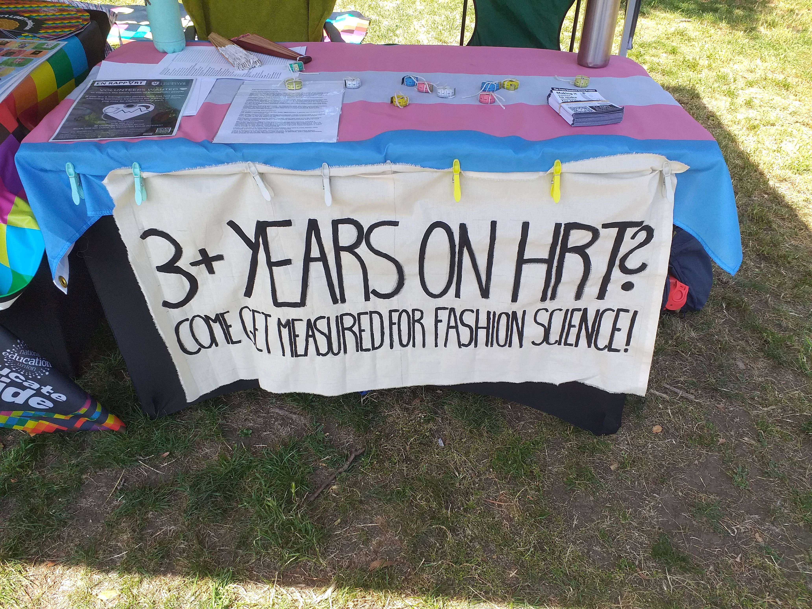
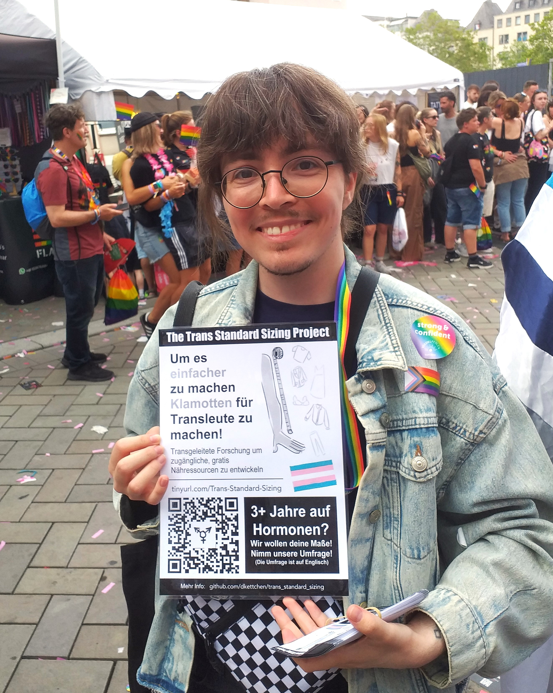

# Pride Events 2026

In summer of 2026, I plan on attending a variety of pride events across the UK (and one in the EU) to spread the word about this project and get more responses for the survey. Feel free to come by and say hi if you see me there!

## Confirmed event schedule so far:
### Events we've been to:
**Sat 23 May - 🚶‍♂️ Birmingham Pride** ✅  
**Sat 27 Jun - 🎪🪑 Southwark Pride (SE1 London)** ✅  
**Sun 05 Jul - 🚶‍♂️ Cologne Pride / CSD (Germany)** ✅  
**Sun 19 Jul - 🎪🪑 Leeds Pride** ✅

### Upcoming events:
**Sat 25 Jul - 🚶‍♂️ Trans Pride London**  
**Sun 26 Jul - 🎪🪑 Stockport Pride (Greater Manchester)** (runs 11am-7pm)  
**Sat 01 Aug - 🚶‍♂️ Trans Pride Manchester**  
**Sat 29, Sun 30, Mon 31 Aug - 🎪🪑 Manchester Village Pride**

🎪🪑 = A stall (staffed with myself and some friends) where you can come and get measured  
🚶‍♂️ = Catch me (and friends) walking around with a sign and handing out flyers and measuring tapes