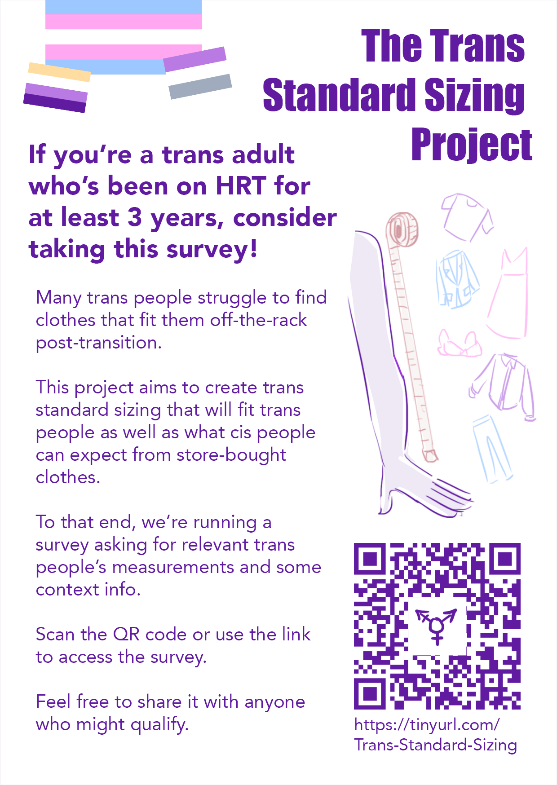

LINK TO THE SURVEY: https://tinyurl.com/Trans-Standard-Sizing

You'll need:
- some time
- a measuring tape
- means to mark some measurements on yourself (string, and/or pins (if clothed) or a pen/makeup pencil (if shirtless))
- a long straight object like a ruler
- a friend/loved one to help you measure
- if you habitually tuck/pack/bind, the means to do so

 

